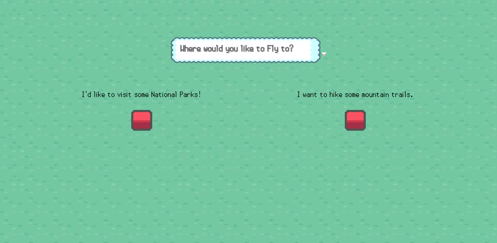
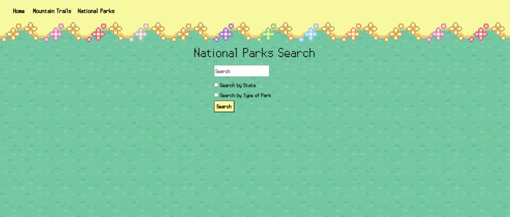
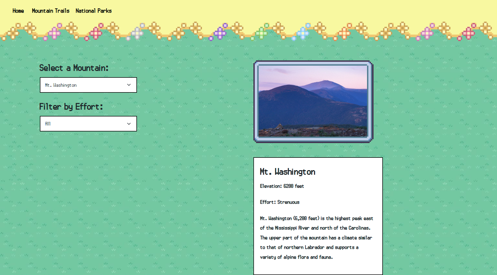

Week 7 Capstone Project of "The Town Map", a website designed to provide comprehensive information and resources related to mountainous regions and America's national parks at the click of a button.

(To download my code, click on the Release link up and to the right)

In this project, I created "The Town Map", a website that enables users to search mountains to hike or national parks to visit is an online platform designed to provide comprehensive information and resources related to outdoor recreational activities in mountainous regions and national parks. This website serves as a valuable tool for individuals who are passionate about hiking, nature exploration, and adventure.

There are 4 main pages in the website.

The home page
The mountains search page
The national parks search page
An easter egg page

All the images in the website, are either assets from Pokemon HeartGold and Pokemon Emerald, or assets that have been provided to me by my instructor.

I'm very proud of the branding, as it wasn't designed to be a normal page that can be searched through Google, but more of word-of-mouth, niche website that would give people comfort.

